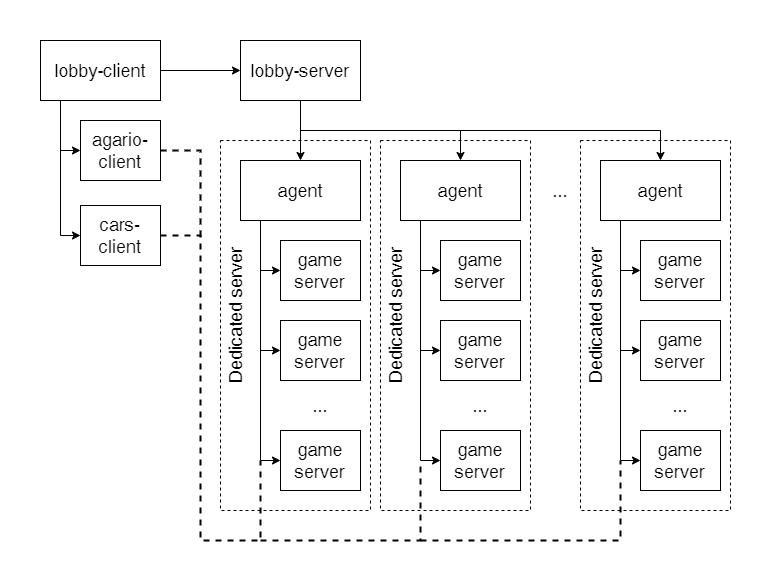

# Описание
Это клиент-серверный проект для игровых серверов.

Основан на bgfx, glfw, imgui для рендеринга и ENet для сетевого взаимодейсвтия

Проект содержит две клиент-серверные игры, лобби-клиент, лобби-сервер и агент для запуска игровых серверов на выделенном сервере 
- Первая игра похожая на agario, игроки управляют сферой, которая может поглащать сферы других игроков или ботов, которые меньше ее. На сервер посылаются импуты от игроков и уже на нем происходит расчет перемещения и посылаются пакеты с новым положением сущностей.
- Вторая игра про возможность управлять машиной в виде капсулы. Основной функционал реализованный в данной игре: 
- - На сервере происходит вся симуляция, все данные посылаются в виде снепшотов
- - На клиенте реализована интерполяция между снепшотами при потере пакетов
- - Реализована локальная симуляция для сущности управляемой клиентом, и перенакатом физики при различиях между полученными значениями от сервера
- Лобби-клиент - приложение для создания и вступления в комнаты, которые можно создать для двух игр. С его помощью игрок может получить от лобби-сервера информацию о созданных комнатах, кто подключен и подключиться к сессии, которая уже стартовала, каждая комната имеет свой набор атрибутов в зависимости от типа игры.

Видеодемонстрацию проекта вы можете увидеть тут: https://disk.yandex.ru/i/QbswJCAiPKrv7A

### Список модификторов для серверов

Для agario
- aiSize - количество ботов в игре 0-32
- minStartRadius - минимальный размер сфер на старте 0.0-3.0
- maxStartRadius - максимальный размер сфер на старте 0.0-3.0
- weightLoss - потеря веса сущности, которую съели 0.0-1.0
- speedModif - модификатор скорости 0.1-10.0

Для cars
- forward_accel - ускорение движения вперед 0.0-30.0
- break_accel - ускорение движения назад 0.0-30.0
- speed_rotation - скорость поворота 0.0-1.0

## Архитектура
На каждом выделенном сервере разворачивается Агент, который может запускать игровые сервера при получении сигнала о создании от лобби-сервера. Все клиенты изначально подключатся к лобби-серверу, где он может послать информацию о игровых комнатах, когда один из игроков нажимает 'старт', то лобби-сервер посылает сообщение до выбранного Агента. Агент создает игровой сервер и далее посылает информацию о подключении. Далее эта информация посылается от лобби-сервера до лобби-клиента. Лобби-клиент запускает клиент выбранной игры с выбранными параметрами. Далее клиент игры связывается с сервером игры и можно играть! 


# Как собирать клиенты с Visual Studio
Требования: Visual Studio 2017+ и Cmake
1. Склонировать 3rdParty submodules
```
git submodules init
git submodules update
```
2. Соборка bgfx
```
cd 3rdParty/bgfx/
../bx/tools/bin/windows/genie --with-examples vs2017
```
3. Сборка glfw
```
cd ../glfw/
cmake .
```
4. Для glfw проекта установить Multi-threaded Debug (/MTd)

5. Скачать [Enet 1.3.17](http://enet.bespin.org/Downloads.html) с скопировать папку в 3rdParty
6. Использовать .sln для сборки клиентов для lobby\agario\cars

# Как собрать сервера на Ubuntu или WSL
1. Скачать и распаковать [Enet 1.3.17](http://enet.bespin.org/Downloads.html)
2. Установить библиотку следюущей командой:
```
./configure && make && sudo make install
```
3. Сделать папки для сборки
```
mkdir lobby/bin
mkdir agario/bin
mkdir cars/bin
```
4. Собрать и запустить agent и lobby-server 
```
g++ lobby/agent.cpp lobby/protocol.cpp -o lobby/bin/agent -lenet
g++ lobby/lobby-server.cpp lobby/protocol.cpp -o lobby/bin/lobby-server -lenet

./lobby/bin/agent
./lobby/bin/lobby-server
```
5. Собрать и запустить можно сервера для agario и cars следующими командами
```
g++ -std=c++17 agario/server.cpp agario/protocol.cpp -o agario/bin/server -lenet
g++ cars/server.cpp cars/protocol.cpp cars/entity.cpp -o cars/bin/server -lenet

./agario/bin/server
./cars/bin/server
```
Также вы можете запустить сервера со следующими параметрами
```
./agario/bin/server [hostName] [port] [aiSize] [minStartRadius] [maxStartRadius] [weightLoss] [speedModif]
./cars/bin/server [hostName] [port] [forward_accel] [break_accel] [speed_rotation]
```
Пример с реальными параметрами
```
./agario/bin/server 127.0.0.1 10131 10 0.1 1.5 0.9 1.0
./cars/bin/server 127.0.0.1 10131 12.0 3.0 0.3
```
Также вы можете запустить клиенты agario и cars напрямую с параметрами
```
./agario/x64/Debug/agario.exe [hostName] [port] [speedModif]
./cars/x64/Debug/cars.exe [hostName] [port] [forward_accel] [break_accel] [speed_rotation]
```

В lobby/bin/ServersList.txt вы можете установить имя хоста для агентов запущенных на выделенных серверах.

Для lobby-client рядом с lobby-client.exe в LobbyHostName.txt вы можете записать имя хоста до lobby-server. По умолчанию используется localhost. 
